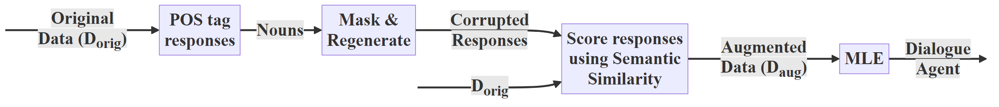

# Score Before You Speak
<a href="https://arxiv.org/abs/2508.06886"></a>
<a href="https://arpita2512.github.io/score_before_you_speak/"></a>
<a href="https://huggingface.co/collections/Arpita1/score-before-you-speak-68a4a9f2b2598c476d35b723"></a>
<br>

Code repository for the ECAI 2025 paper **Score Before You Speak: Improving Persona Consistency in Dialogue Generation using Response Quality Scores**



## Installation

Experiments were conducted on two different setups (see supplementary material). The main requirements are `transformers, datasets, tqdm, stanza, bert-score, accelerate, wandb`. For exact environments used, please refer to *persona.yml* for DialoGPT and *llama.yml* for Llama 3.1. Downloading Llama also requires agreeing to the community license and setting the `HF_TOKEN` environment variable.

```
git clone https://github.com/arpita2512/score_before_you_speak.git
cd score_before_you_speak
conda env create -f <environment-name>.yml
pip install stanza
pip install bert-score
```

## Data

PERSONA-CHAT and ConvAI2 are available through [ParlAI](https://github.com/facebookresearch/ParlAI). We use the `<split>_self_original.txt` files for all splits of both datasets.

## Pre-processing

### Pos-tagging

```
python preprocess/postag.py <path_to_txt_file> # saves pos-tagged file as json
```

**Data Format after Pos-tagging**

```
{
    "persona": [
      ...
    ],
    "queries": [
      ...
    ],
    "responses": [
      ...
    ],
    "response_postags": [
      [
        [
          word,
          pos-tag
        ],
        ...
      ]
      ...
    ]
}
```

### Masking

```
python preprocess/masking.py <path_to_pos_tagged_json> # saves data with filled masks as json
```

Note: Batch size for `bart-large` is set to 500 and may need to modified based on GPU memory available.

**Data Format after Masking**

```
{
    "persona": [
      ...
    ],
    "queries": [
      ...
    ],
    "responses": [
      ...
    ],
    "aug_data": [
      {
        "original": ...,
        "masked": [
          ..., # completion for mask 1
          ... # completion for mask n
        ]
      },
    ]
} # postags removed after masking to reduce data size 
```

### Scoring

```
python preprocess/scoring.py <path_to_masked_json> # saves data with scores as HF dataset
```

**Data Format after Scoring**

```
{
    'persona': ....,
    'history': ['User: ...,
        'Bot: ...,
        ...
        'User: ...],
    'response': ...
    'score': ...
}
```

## Training

### DialoGPT

```
python train/train_dgpt.py --exp_name <project_name_for_wandb> --dataset_path <path_to_HF_dataset> --n_epochs <number_of_epochs> --output_path <save_path_for_model>
```

Set n_epochs to 15 for PERSONA-CHAT and 6 for ConvAI2.

Notes: 
- Batch size is set to 16 and may need to modified based on GPU memory available.
- Wandb tracking requires an account and API key ([see here](https://docs.wandb.ai/models/quickstart#install-the-wandb-library-and-log-in))

**Prompt Template**

<|startoftext|>Your persona: *persona information*<|sp1|>User: *user utterance 1*<|sp2|>Bot: *bot utterance 1*<|sp1|>User: *user utterance 2 Score: ..*<|sp2|>Bot: *bot utterance 2*<|endoftext|>

### Llama 3.1

**Prompt Template** (based on [Llama 3.1 model card](https://www.llama.com/docs/model-cards-and-prompt-formats/llama3_1/#prompt-template))

<|begin_of_text|><|start_header_id|>system<|end_header_id|>

Cutting Knowledge Date: December 2023
Today Date: 26 Jul 2024

*persona information*..<|eot_id|><|start_header_id|>user<|end_header_id|>

*user utterance 1*<|eot_id|><|start_header_id|>assistant<|end_header_id|>

*bot utterance 1*<|eot_id|><|start_header_id|>user<|end_header_id|>

*user utterance 2 Score: ..*<|eot_id|><|start_header_id|>assistant<|end_header_id|>

*bot utterance 2*<|eot_id|>